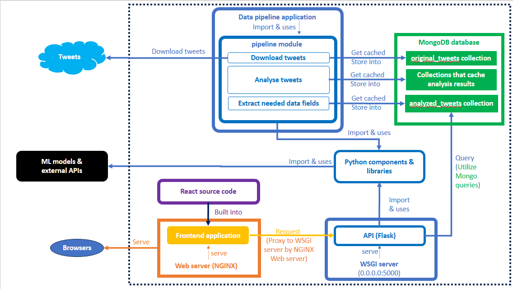
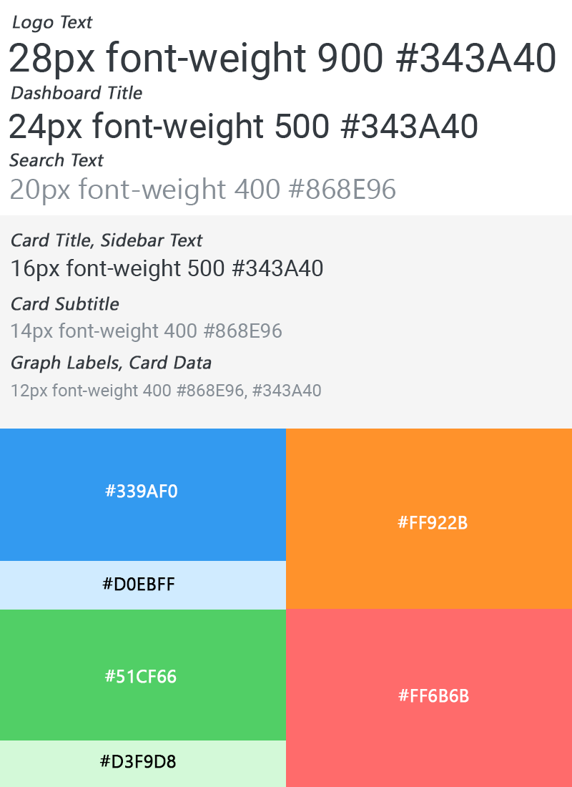

# SEP30 - Mental Health Dashboard

## Table of contents

- [Technologies used](#technologies-used)
  * [Frontend](#frontend)
  * [Backend](#backend)
  * [Database](#database)
- [System Architecture description](#system-architecture-description)
- [Local installation and deployment in a development environment](#local-installation-and-deployment-in-a-development-environment)
  * [Pre-requisites](#pre-requisites)
  * [Dependencies](#dependencies)
    + [Frontend's Node modules](#frontend-s-node-modules)
    + [Backend's Python packages](#backend-s-python-packages)
  * [Setup](#setup)
    + [Download the source code](#download-the-source-code)
    + [Install frontend dependencies](#install-frontend-dependencies)
    + [Install backend dependencies](#install-backend-dependencies)
  * [Deployment of the dashboard](#deployment-of-the-dashboard)
    + [Frontend](#frontend-1)
    + [API](#api)
  * [Deployment of the data pipeline](#deployment-of-the-data-pipeline)
    + [MongoDB](#mongodb)
    + [Data pipeline](#data-pipeline)
- [Deployment in a production environment](#deployment-in-a-production-environment)
   * [Pre-requisites](#pre-requisites-1)
   * [Setup](#setup-1)
      + [Nginx](#nginx)
   * [Deployment of the dashboard](#deployment-of-the-dashboard-1)
      + [Frontend](#frontend-2)
      + [API](#api-1)
   * [Deployment of the data pipeline](#deployment-of-the-data-pipeline-1)
- [Source code, folder and file structure](#source-code--folder-and-file-structure)
   * [Root](#root)
   * [Frontend](#frontend-3)
   * [Backend](#backend-1)
- [Testing](#testing)
- [API documentation](#api-documentation)
   * [Proxying requests from the frontend to the backend](#proxying-requests-from-the-frontend-to-the-backend)
   * [List of API endpoints](#list-of-api-endpoints)
- [Color palettes, themes, and dark mode](#color-palettes--themes--and-dark-mode)
- [Features expansion manual](#features-expansion-manual)
- [Project description](#project-description)


## Technologies used

### Frontend
- Web framework: React.js
- Languages: TypeScript, JavaScript, HTML, CSS
- Tools: Node, npm, Vite, 

### Backend
- Web framework (API): Flask
- Languages: Python
- Tools: pip

### Database
- MongoDB

## System Architecture description



Our system consists of a data warehouse, a data analysis server side application, an API, and a frontend web application.

- In the backend, we have a list of **Python components** that are Python modules that provide the ability to collect, process, and analyse data from Twitter. These modules are used by the **data analysis server side application** to collect, process, and analyse data from Twitter, and by the **API** to expose those functions to the **frontend**. In this document, we will refer to these modules as **Python components** or **components**. 

- The **data analysis server side application** is responsible for collecting, processing, and analysing data from Twitter. For this document, we will refer to this application as the **data pipeline**, **analysis pipeline**, or just **pipeline**.

- The **data warehouse** is responsible for storing the collected data, processed data, and analysis results by the **data pipeline**. For our project, we are using a MongoDB database called `twitter_db` as our data warehouse. We will refer to this database as the **data warehouse** or **database** in this document.

- The **API** is responsible for providing the frontend web application with the processed data from the **data warehouse**, and the analysis functions provided by the **Python components**. In this document, we will refer to this application as the **API**.

- All the **Python components**, the **data pipeline**, and the **API** are stored in the `backend` folder.

- The **frontend web application** is responsible for displaying the **dashboard**. The **dashboard** is a **web application** that provides users with various visualisations, insights and analysis results related to mental health discussions on Twitter. In this document, we will refer to this application as the **frontend**.

- The **frontend** is stored in the `frontend` folder.

## Local installation and deployment in a development environment

### Pre-requisites

- Operating system: Windows 10/11 or Ubuntu 22.04.
- Internet connection.
- Node.js. Recommended version: Node v20.7.0
- Python 3. Recommended version: Python 3.11.5
- pip (Python package manager). Recommended version: pip 23.2.1
- MongoDB. Recommended version: v7.0.0

### Dependencies

#### Frontend's Node modules

- **Node modules**: A list of all the Node modules used in this project can be found in the `package.json` and `package-lock.json` file in the `frontend` folder.

#### Backend's Python packages

A list of all the neccessary Python packages used in this project can be found in the `requirements.txt` file in the `backend` folder. 

In the `backend` folder, we also have a `requirements-full-ubuntu.txt` file for all Python packages needed specifically for Ubuntu 22.04, and a `requirements-full-windows.txt` file for all Python packages needed specifically for Windows 10/11.

### Setup

#### Download the source code

To setup the project, you will need to download this repository, i.e. the source code of this project.

You can clone this repository using the following command:

```bash
git clone git@github.com:morganrmcconnon/SEP30.git
```

#### Install frontend dependencies

Nagivate to frontend folder and install the required node dependencies:
```bash
cd frontend
npm install
```

#### Install backend dependencies

Nagivate to backend folder and install required dependencies from the `requirements.txt` file:
```bash
cd backend
pip install -r requirements.txt
```

You can also choose to install all the dependencies from the `requirements-full-ubuntu.txt` file if you are using Ubuntu 22.04, or from the `requirements-full-windows.txt` file if you are using Windows 10/11.

### Deployment of the dashboard

To deploy the dashboard, you will only need to start the **frontend**, and the **API**. You may also need to start MongoDB so that the dashboard can collect data from the database, however the current implementation is set up so that you don't need to start MongoDB. The API will instead send data from a cached file called `backend/cache/backend_response.json`. 

In addition, you will also need to start the **data pipeline** to collect, process, and analyse Twitter data.

#### Frontend

Run the following command to start the frontend app:
```bash
npm run dev
```

#### API

Run the following command to start the API:
```bash
flask --app app.py run
```
or
```bash
flask run 
```
(this command will automatically run the Flask API application since we named the main python file as `app.py`)

### Deployment of the data pipeline

#### MongoDB

To execute the data pipeline, you will first need to start MongoDB so that the **data pipeline** can store the collected data, processed data, and analysis results in the database. 

#### Data pipeline

Run the following command to start the **data pipeline**:

```bash
# On Windows:
python populate_data.py
# On Ubuntu:
python3 populate_data.py
```

The `populate_data.py` script is a CLI that will use the `components/pipeline.py` module to start collecting, processing, and analysing Twitter data on October 15th, 2022 at 12:00 pm. The data is downloaded from the Internet Archive's Twitter Stream Collection.

Optionally, you can also run the following command to start the `populate_data.py` script to download data from a specific date, and/or to download data on loop from a starting date forward/backward a specific time. For example, to download data from October 9th, 2022, at 1:30 pm, looping from that date, forward, in an interval of 1 day, 2 hours, and 3 minues, run the following command:

```bash
python populate_data.py -d 9 -m 10 -y 2022 -H 13 -M 30 -dd 1 -dH 2 -dM 3 -l -f
```

## Deployment in a production environment

### Pre-requisites

All the pre-requisites and dependencies for the development environment are also required for the production environment.

In addition, you will also need to install the following:

- A web server that can also be used as a reverse proxy, load balancer, mail proxy and HTTP cache. We will use this web server as a reverse proxy to serve the frontend and the API. For this document, we will use **Nginx**.

- A Python WSGI HTTP Server for serving the Flask **API**. Recommended: **Gunicorn** (if not Windows) or **Waitress** (if on Windows). We have written a `server.py` file in the `backend` folder that will serve the Flask application using **Waitress**. You can use this file to serve the Flask application using a WSGI HTTP Server.

### Setup

#### Nginx

First, download and install Nginx.

Then, configure Nginx to proxy all request to endpoints starting with `/api/` or `/backend/` to port 5000 (127.0.0.1:5000).

i.e. configure and add the following to the nginx configuration file (for Windows, it is `nginx.conf`, for Ubuntu, it is `/etc/nginx/sites-available/default`):

```
# proxy the API requests to the Flask server listening on port 5000
location /api/ {
   proxy_pass http://127.0.0.1:5000/api/;
}

# proxy the API requests to the Flask server listening on port 5000
location /backend/ {
   proxy_pass http://127.0.0.1:5000/backend/;
}
```

We have also written example NGINX configuration files in the `nginx` folder

### Deployment of the dashboard

Similar to the development environment, to deploy the dashboard, you will only need to start the **frontend**, and the **API**. You may also need to start MongoDB so that the dashboard can collect data from the database, however the current implementation is set up so that you don't need to start MongoDB. The API will instead send data from a cached file called `backend/cache/backend_response.json`.

#### Frontend

To deploy the frontend, you will need to build the frontend app and serve the built app using a web server.

Run the following command to build the frontend app:

```bash
npm run build
```

This will create a `dist` folder in the `frontend` folder. You can then serve the `dist` folder using the web server.

#### API

To deploy the API, you will need to serve the Flask application using a WSGI HTTP Server.

We have written a `server.py` file in the `backend` folder that will serve the Flask application. You can use this file to serve the Flask application using a WSGI HTTP Server.

Run the following command to serve the Flask application using the `server.py` file:

```bash
python server.py
```

### Deployment of the data pipeline

Deploying the data pipeline is the same as deploying the pipeline in the development environment.


## Source code, folder and file structure

### Root

The root folder contains the following folders:

- `frontend`: The frontend folder, containing the frontend's source code.
- `backend`: The backend folder, containing the backend's source code.
- `nginx`: The nginx folder, containing the nginx configuration file that developers can use to configure the NGINX server.
- `research`: The research folder, containing the research code used for this project.
- `api`: Containing the sample API requests and responses, for references by the frontend/backend team.
- `aws`: Containing the scripts used to deploy the dashboard to AWS if needed.
- `old`: Containing the old source code of the dashboard.
- `docs`: Containing the documentation of the project and the docs' images.

### Frontend

The frontend's source code is stored in the `frontend` folder.

The frontend's source code is structured as follows:

- `src`: The source of all TS, TSX, JS, JSX files written for the frontend.
- `public`: The source of all static files used by the frontend.
- `dist`: The built frontend app.
- `node_modules`: The node modules used by the frontend.

It also contains a number of files, including:

- `package.json`: The file containing the list of all the frontend's dependencies.
- `package-lock.json`: The file containing the list of all the frontend's dependencies, including the dependencies of the dependencies. This file is automatically generated by npm. It contains the exact version of each dependency that was installed.
- `vite.config.ts`: The file containing the configuration for the frontend's development server. This file is used to proxy all requests to endpoints prefixed with `/api/` and `/backend/` to the backend.
- `tsconfig.json`: The file containing the configuration for the frontend's TypeScript compiler.
- `index.html`: The file containing the HTML template for the frontend.

The `src` folder contains the following folders:

- `components`: The folder containing all the React components used by the frontend.
- `pages`: The folder containing all the React pages used by the frontend.
- `contexts`: The folder containing all the React contexts used by the frontend.
- `styles`: The folder containing all the CSS styles used by the frontend.
- `utils`: The folder containing all the utility functions used by the frontend.
- `assets`: The folder containing all the assets used by the frontend.
- `constants`: The folder containing all the constants used by the frontend.
- `data`: The folder containing all the types and functions related to the data used by the frontend. Including the types of the data returned by the backend's API, and the functions used to format the data returned by the backend's API and update the dashboard's visualisations.

The `src/components` folder contains the following folders:

- `main`: The folder containing the React components used for the main section of the page.
- `sidebar`: The folder containing the React components used for the sidebar section of the page.
- `header`: The folder containing the React components used for the header section of the page.
- `grids`: The folder containing all grid components used by the Dashboard. The dashboard has a grid layout where its layout is split into grids. The grids are used to display the dashboard's visualisations.
- `about_grids`: The folder containing all grid components used by the About page.
- `grid_components`: The folder containing all the React components used by the grids.

The `src/data` folder contains the following folders:

- `api`: The folder containing all the types and functions related to the data returned by the backend's API.
- `grids`: The folder containing all the types and functions related to the data used by the grids.

Each of the `src/data/api` and `src/data/grids` folders contains the following folders:

- `types`: The folder containing all the types related to the data used.
- `functions`: The folder containing all the functions related to the data used.
- `constants`: The folder containing all the constants related to the data used.


### Backend

The backend's source code is stored in the `backend` folder.

The backend contains the following folders and files:

- `app.py`: A program (i.e. a script). The main file containing the Flask application.
- `server.py`: A program (i.e. a script). The file containing the code to serve the Flask application using a WSGI HTTP Server.
- `populate_data.py`: A program (i.e. a script). The file containing the code to start the data pipeline.
- `create_topic_model.py`: A program (i.e. a script). The file containing the code to create the default LDA topic model.
- `requirements.txt`: The file containing the list of all the backend's dependencies.
- `requirements-full-ubuntu.txt`: The file containing the list of all the backend's dependencies, including the dependencies of the dependencies. This file is used if you are using Ubuntu 22.04.
- `requirements-full-windows.txt`: The file containing the list of all the backend's dependencies, including the dependencies of the dependencies. This file is used if you are using Windows 10/11.
- `cache`: The folder containing the cached backend's response data.
- `components`: The folder containing all the Python modules written by the development team and used by the backend. This is also a Python module.
- `testing_analyze_tweets`: The folder containing the code used to test the `components/analyze_tweets` module.
- `dependencies`: The folder containing the libraries that are dependencies of the backend. Some of the libraries that are dependencies of the backend either contain bugs or cannot be installed using `pip`. Therefore, we manually downloaded the source code of those libraries, debugged them, and put them in this folder. To install these libraries, navigate to each library in this folder and run the following command: `pip install .`.

The `components` folder contains the following folders:

- `analyze_tweets`: The folder containing the code used to analyze tweets.
- `download_tweets`: The folder containing the code used to collect tweets from Internet Archive's Twitter Stream Collection.
- `topic_model`: The folder containing the default LDA topic model.
- `data`: The folder containing the data files used by the components.

It also contains a number of files, including:
- `__init__.py`: The file containing the code to make the `components` folder a Python module.
- `constants.py`: The file containing the constants used by the programs.
- `pipeline.py`: The file detailing the data pipeline. It contains functions that can be imported to analyze tweets.


## Testing

We have also written a number of unit tests for the backend's components. The unit tests for testing the analyze_tweets components are stored in the `testing_analyze_tweets` folder.

To run the unit tests, navigate to the `components` folder and run the following command:

```bash
cd backend/components
python -m testing_analyze_tweets.[test_file_name]
```

Example:
   
```bash
cd backend/components
python -m testing_analyze_tweets.tweet_text_test
```


## API documentation

### Proxying requests from the frontend to the backend

By default, all frontend's requests endpoints prefixed with `/api/` and `/backend/` will be rerouted to the backend. For example, if the frontend makes a request to `/api/example/endpoint`, the request will be sent to the `/api/example/endpoint` endpoint in the backend.

This was done by configuring the `vite.config.ts` file in the `frontend` folder.

### List of API endpoints

All the backend's API endpoints are defined in the `backend/app.py` file.

All the API endpoints are prefixed with `/api/`.

#### POST `/api/data`

This is the main endpoint used by the dashboard.

This endpoint is used to get the analysis result data from the database.

The request body should be a JSON object with the following properties:

- `start`: The start unix timestamp of the data to be retrieved in milliseconds. Example: `1634290800000` for October 15th, 2022 at 12:00 pm.
- `end`: The end unix timestamp of the data to be retrieved in milliseconds. Example: `1634377200000` for October 16th, 2022 at 12:00 pm.


Example: 

```json
{
    "start": 1634290800000,
    "end": 1634377200000
}
```

The response body will be a JSON object with the following properties:

- `tweet_objects`: An array containing the mental health related tweet objects selected between start timestamp and end timestamp.
- `aggregate_results`: An object containing the aggregate results of the data.
- `lda_topic_model`: An object containing the information regarding the LDA topic model.

`tweet_objects` is an array containing the mental health related tweet objects selected between start timestamp and end timestamp. Each tweet object is represented by a JSON object with the following properties:
- `id_str`: The tweet's id.
- `timestamp_ms`: The tweet's timestamp in milliseconds.
- `text`: The tweet's text.
- `text_in_english`: The tweet's text in English.
- `text_processed`: The tweet's text tokenized, lemmatized, and stop words removed.
- `lang`: The tweet's language.
- `spacy_match`: An object containing the information regarding the tweet's spacy match. This object has the following properties:
   - `original`: A boolean indicating whether the tweet's text is an original tweet or not.
   - `in_english`: A boolean indicating whether the tweet's text is in English or not.
- `sentiment`: The tweet's sentiment. Values are: `positive`, `negative`, `neutral`.
- `topic_lda`: An object containing the information regarding the tweet's related topic, resulted from topic modelling using Latent Dirichlet Allocation (LDA). This object has the following properties:
   - `model_id`: The LDA model id.
   - `topic_id`: The LDA topic id with the highest probability.
   - `related_topics`: An object containing the information regarding the tweet's related topics. This object has the following properties:
      - `cosine_similarity`: An array containing the top 5 related topics sorted by cosine similarity.
      - `hellinger_distance`: An array containing the top 5 related topics sorted by hellinger distance.
- `topic_bert_arxiv`: An object containing the information regarding the tweet's related topic, resulted from topic modelling using BERTArxiv  topic model. This object has the following properties:
   - `topic_id`: The BERT topic id with the highest probability.
   - `topic_name`: The BERT topic name with the highest probability.
- `topic_cardiffnlp`: An object containing the information regarding the tweet's related topic, resulted from topic modelling using CardiffNLP's RoBERTa Tweet Topic model. This object has the following properties:
   - `topic_id`: The CardiffNLP topic id with the highest score.
   - `topic_name`: The CardiffNLP topic name with the highest score.
   - `topic_score`: The CardiffNLP topic score with the highest score.
- `user`: An object containing the information regarding the tweet's user. This object has the following properties:
   - `id_str`: The user's id.
   - `country_code`: The user's country code.
   - `country_name`: The user's country name.
   - `age`: The user's age. Values are: `<=18` , `19-29` , `30-39` , `>=40`.
   - `gender`: The user's gender. Values are: `male`, `female`.
   - `org`: Whether the user is an organisation or not. Values are: `org`, `non-org`.
   - `lang`: The user's language.


`aggregate_results` is an object with the following properties:
- `total_tweets_count`: The total number of tweets collected between start timestamp and end timestamp, mental health related or not.
- `related_tweets_count`: The total number of tweets that are related to mental health collected between start timestamp and end timestamp. We considered a tweet is related to mental health if `"spacy_match.original" == true`, or `"spacy_match.in_english" == true`, or `"topic_bert_arxiv.topic_id" == 55` (i.e., topic is `55_depression_mental_health_mental health`).

`lda_topic_model` is an object with the following properties:
- `keywords_representation`: An object containing the keywords representation of each topic. Each topic is represented by an array of keywords, where each keyword is represented by an array of 2 elements, the first element is the keyword, and the second element is the keyword's probability (weight).
- `labels`: An array containing the topic labels. Each topic label is represented by an array of 2 elements, the first element is the topic label, and the second element is an array of topic_ids, where each topic_id is an array of 2 elements, the first element is the topic id, and the second element is the topic's probability (weight).


For example:

```json
{
   "aggregate_results": {
      "total_tweets_count": 0,
      "related_tweets_count": 0,
   },
   "lda_topic_model": {
      "keywords_representation": {
         "0": [
            ["word0", 0.10],
            ["word1", 0.10],
            ["word2", 0.10],
            ["word3", 0.10],
            ["word4", 0.10],
            ["word5", 0.10],
            ["word6", 0.10],
            ["word7", 0.10],
            ["word8", 0.10],
            ["word9", 0.10]
         ],
         "1": [
            ["word0", 0.10],
            ["word1", 0.10],
            ["word2", 0.10],
            ["word3", 0.10],
            ["word4", 0.10],
            ["word5", 0.10],
            ["word6", 0.10],
            ["word7", 0.10],
            ["word8", 0.10],
            ["word9", 0.10]
         ],
      },
      "labels": [
         ["topic0", [
            [1, 0.1],
            [2, 0.1],
            [3, 0.1],
            [4, 0.1],
            [5, 0.1],
            [6, 0.1],
            [7, 0.1],
            [8, 0.1],
            [9, 0.1],
            [10, 0.1]
         ]],
         ["topic1", [
            [1, 0.1],
            [2, 0.1],
            [3, 0.1],
            [4, 0.1],
            [5, 0.1],
            [6, 0.1],
            [7, 0.1],
            [8, 0.1],
            [9, 0.1],
            [10, 0.1]
         ]]
      ],
   },
   "tweet_objects": [
      {
         "id_str": "1000000000000000000",
         "timestamp_ms": "1665000000000",
         "text": "",
         "text_in_english": "",
         "text_processed": ["word1", "word2"],
         "lang": "en",
         "spacy_match": {
            "original": true,
            "in_english": true
         },
         "sentiment": "neutral",
         "topic_lda": {
            "model_id": "0",
            "topic_id": 0,
            "related_topics": {
               "cosine_similarity": [ "A", "B", "C", "D", "E"],
               "hellinger_distance": [ "A", "B", "C", "D", "E"]
            }
         },
         "topic_bert_arxiv": {
            "topic_id": 55,
            "topic_name": "55_depression_mental_health_mental health"
         },
         "topic_cardiffnlp": {
            "topic_id": 16,
            "topic_name": "sports",
            "topic_score": 0.9
         },
         "user": {
            "id_str": "1000000000000000000",
            "country_code": "",
            "country_name": "",
            "age": "19-29",
            "gender": "male",
            "org": "non-org",
            "lang": ""
         }
      },
   ]
};
```


#### GET `/api/get_cached`

This endpoint is used to get the cached backend's response data from the file `backend/cache/backend_response.json`.

Currently, for development purposes, and to avoid having to start MongoDB during development, this is the actually endpoint used by the frontend to get the analysis result data, instead of the `/api/data` endpoint.

This endpoint does not require any request body, and the response body will be the same as the `/api/data` endpoint.


#### POST `/api/analysis/translate`

This endpoint is used to translate text from any language to English.

The request body should be a JSON object with the following properties:

- `text`: The text to be translated.

Example: 

```json
{
    "text": "Hola, ¿cómo estás?"
}
```

The response body will be a JSON object with the following properties:

- `in_english`: The translated text in English.
- `lang_detected`: The language code of the text being detected.

Example:

```json
{
    "in_english": "Hello, how are you?",
    "lang_detected": "es"
}
```

#### POST `/api/analysis/text/processed`

This endpoint is used to process text by tokenizing, lemmatizing, and removing stop words.

The request body should be a JSON object with the following properties:

- `text`: The text to be processed.

Example: 

```json
{
    "text": "Hello, good morning!"
}
```

The response body will be a JSON object with the following properties:

- `text_processed`: The processed array of words.

Example:

```json
{
    "text_processed": ["hello", "good", "morning"]
}
```


#### POST `/api/analysis/filter/spacy`

This endpoint is used to check whether a text is related to mental health or not.

The request body should be a JSON object with the following properties:

- `text`: The text to be checked.

Example: 

```json
{
    "text": "Depression."
}
```

The response body will be a JSON object with the following properties:

- `is_related`: A boolean indicating whether the text is related to mental health or not.

Example:

```json
{
    "is_related": true
}
```

#### POST `/api/analysis/sentiment/vader`

This endpoint is used to check the sentiment of a text using NLTK's vader.

The request body should be a JSON object with the following properties:

- `text`: The text to be checked.

Example: 

```json
{
    "text": "I am happy."
}
```


The response body will be a JSON object with the following properties:

- `compound_score`: The compound score of the text.
- `sentiment_label`: The sentiment label of the text. Values are: `positive`, `negative`, `neutral`.

Example:

```json
{
    "compound_score": 0.5,
    "sentiment_label": "positive"
}
```


#### POST `/api/analysis/sentiment/roberta`

This endpoint is used to check the sentiment of a text using CardiffNLP's RoBERTa Tweet Sentiment.

The request body should be a JSON object with the following properties:

- `text`: The text to be checked.

Example: 

```json
{
    "text": "I am happy."
}
```

The response body will be a JSON object with the following properties:

- `sentiment_result`: The sentiment result of the text. Values are: `positive`, `negative`, `neutral`.
- `confidence_probabilities`: An object containing the confidence probabilities of the sentiment result. This object has the following properties:
   - `positive`: The confidence probability of the text being positive.
   - `negative`: The confidence probability of the text being negative.
   - `neutral`: The confidence probability of the text being neutral.

Example:

```json
{
    "sentiment_result": "positive",
   "confidence_probabilities": {
      "positive": 0.5,
      "negative": 0.3,
      "neutral": 0.2
   }
}
```

#### POST `/api/analysis/topic/bertaxiv`

This endpoint is used to detect the topic of a text using BERTopic trained on arXiv papers.

The request body should be a JSON object with the following properties:

- `text`: The text to be checked.

Example: 

```json
{
    "text": "I am tired."
}
```

The response body will be a JSON object with the following properties:

- `topic_id`: The topic id of the text.
- `topic_name`: The topic name of the text.
- `probability`: The probability of the text being related to the topic.

Example:

```json
{
    "topic_id": 55,
    "topic_name": "55_depression_mental_health_mental health",
    "probability": 0.5
}
```

#### POST `/api/analysis/topic/cardiffnlp`

This endpoint is used to detect the topic of a text using CardiffNLP's RoBERTa Tweet Topic.

The request body should be a JSON object with the following properties:

- `text`: The text to be checked.

Example: 

```json
{
    "text": "I am tired."
}
```

The response body will be a JSON object with the following properties:

- `topic_id`: The topic id of the text.
- `topic_name`: The topic name.
- `topic_score`: The topic score.

Example:

```json
{
    "topic_id": 16,
    "topic_name": "sports",
    "topic_score": 0.9
}
```

#### POST `/api/analysis/topic/lda`

This endpoint is used to detect the topic of a text using Latent Dirichlet Allocation (LDA).

The request body should be a JSON object with the following properties:

- `text`: The text to be checked.

Example: 

```json
{
    "text": "I am tired."
}
```

The response body will be a JSON object with the following properties:

- `topics_distribution`: An array containing the topics distribution of the text. Each topic is represented by an array of 2 elements, the first element is the topic id, and the second element is the topic's probability (weight).
- `highest_score_topic`: The topic id with the highest probability.
- `highest_score_topic_probability`: The highest probability of the topic id with the highest probability.
- `related_topics`: An object containing the information regarding the tweet's related topics. This object has the following properties:
   - `cosine_similarity`: An array containing the top 5 related topics label sorted by cosine similarity.
   - `hellinger_distance`: An array containing the top 5 related topics label sorted by hellinger distance.
- `associated_keywords`: An array of the keywords associated with the tweet as the result of topic modelling.


Example:

```json
{
   "topics_distribution": [
      [1, 0.1],
      [2, 0.1],
      [3, 0.1],
      [4, 0.1],
      [5, 0.1],
      [6, 0.1],
      [7, 0.1],
      [8, 0.1],
      [9, 0.1],
      [10, 0.1]
   ],
   "highest_score_topic": 1,
   "highest_score_topic_probability": 0.1,
   "related_topics": {
      "cosine_similarity": [ "A", "B", "C", "D", "E"],
      "hellinger_distance": [ "A", "B", "C", "D", "E"]
   },
   "associated_keywords": ["word1", "word2"]
}
```

#### POST `/api/analysis/user/location`

This endpoint is used to detect the location of a user.

The request body should be a JSON object with the following properties:

- `text`: The user's location description.

Example: 

```json
{
    "text": "London, UK"
}
```

The response body will be a JSON object with the following properties:

- `latitude`: The latitude of the user's location, or `null` if the latitude cannot be detected.
- `longitude`: The longitude of the user's location, or `null` if the longitude cannot be detected.
- `country_name`: The country name of the user's location, or an empty string `""` if the country name cannot be detected.
- `country_code`: The country code of the user's location, or an empty string `""` if the country code cannot be detected.

Example:

```json
{
    "latitude": 51.5073219,
    "longitude": -0.1276474,
    "country_name": "United Kingdom",
    "country_code": "GB"
}
```


#### POST `/api/analysis/user/demographics/m3inference`

This endpoint is used to detect the demographics of a user.

The request body should be a JSON object with the following properties:

- `name`: The user's name.
- `screen_name`: The user's screen name.
- `description`: The user's description.
- `lang`: The user's language.

Example: 

```json
{
    "name": "John Doe",
    "screen_name": "johndoe",
    "description": "I am a student.",
    "lang": "en"
}
```

The response body will be a JSON object with the following properties:

- `age_predicted`: The predicted age of the user. Values are: `<=18` , `19-29` , `30-39` , `>=40`.
- `gender_predicted`: The predicted gender of the user. Values are: `male`, `female`.
- `org_predicted`: Whether the user is an organisation or not. Values are: `org`, `non-org`.


## Color palettes, themes, and dark mode

To ensure that the frontend's components are consistent in terms of the colors used, we have defined a number of color palettes and themes that can be used by the frontend's components. 

The list of color palettes and themes can be found in the `frontend/src/styles/styles.css` file and the `frontend/src/constants/Colors.ts` file.

To implement dark mode, we have defined a `dark` class in the `frontend/src/styles/styles.css` file, and to invert the colors of the images, we have defined the `--filter-dark` and `--filter-light` CSS variables in the `frontend/src/styles/styles.css` file, used `filter: var(--filter-dark);` inside css classes, and written the following JS/TS code in the `frontend/src/components/header/DarkMode.tsx` file:

```ts
const element = document.body;
element.classList.toggle("dark");
mode ? setMode(false) : setMode(true);
```

This code toggles the `dark` class in the `body` element, and toggles the `mode` state between `true` and `false`. The `mode` state is used to determine whether the dark mode is enabled or not. If the dark mode is enabled, the `dark` class will be added to the `body` element, and the `--filter-dark` CSS variable will be used to invert the colors of the images. If the dark mode is disabled, the `dark` class will be removed from the `body` element, and the `--filter-light` CSS variable will be used to invert the colors of the images.

The colors are defined as follows:

- primary: `#343a40`; (`white` for dark mode) 
- faint: `#868e96`; (`#d9d9d9` for dark mode) 
- secondary: `#f5f5f5`; (`#23272b` for dark mode) 
- blue: `#339af0`; 
- lightblue: `#d0ebff`; 
- green: `#51cf66`; 
- lightgreen: `#d3f9d8`; 
- orange: `#ff922b`; 
- red: `#ff6b6b`; 
- lightred: `#ffcccc`; 
- white: `#ffffff`; 

The image below shows part of the color palettes and themes that we have defined:




## Features expansion manual

### Adding a new grid/visualisation to the dashboard

To add a new visualisation to the dashboard, you can create a new grid component in the `frontend/src/components/grids` folder, then import and use that grid component in the `frontend/src/components/main/DashboardVis.tsx` file by adding it to the array of items to be rendered in the `ResponsiveGridLayout` component:

```tsx
const items = [
   // ... other grids
   { y: 6, x: 0, w: 8, h: 2.7, i: "YourNewGrid", vis: <YourNewGrid /> },
];
```

Similarly, you can also add a new grid to the About page using the same method, but by adding it to the array of items to be rendered in the `ResponsiveGridLayout` component in the `frontend/src/components/main/AboutGrids.tsx` file.

### Updating the data of the new grid component

To allow the grid component to get the data from the backend, you can either do one of the following:

- Get the global tweets list variables from the `DashboardFilteredContext` context (the source of this file is in `frontend/src/contexts/DashboardFilteredContext.tsx`), perform aggregation if neccessary, and update the visualisation. There are two tweets list that you can use; one is `tweetOjects`, which is the list of tweets filtered by the dashboard's filters option `filterOptions`, and the other one is the `tweet_objects` field in `backendData` (i.e. `backendData.tweet_objects`), which is the original list of all the tweets collected by the dashboard from the backend.

- Add a new field to the `DATATYPES` constant (in the `frontend/src/data/grids/constants/DATATYPES.tsx` file) that represents the data structure of the grid, a new aggregation value to the `frontend/src/data/api/functions/AggregateData.ts` functions, add a new updating-the-grid function in the `frontend/src/data/grids/functions/UpdateDashboardData.ts` file that updates the `dashboardData` global variable of the `DashboardFilteredContextType` context. Then, use `dashboardData` in the new grid component.

### Adding a new data analysis function to the backend

To add a new data analysis function to the backend, you can create a new Python module/file in the `backend/components` folder, then import and use that module in the `backend/components/pipeline.py` file.

### Analyzing a list of tweets collected if Twitter API is available 

In the `backend/components/pipline.py` module, there is a function called `analysis_pipeline_full` that can analyse any list of tweet objects. In this project, we used this function to analyse the tweets collected from Internet Archive's Twitter Stream collection, however this function can be used to analyse any list of tweet objects, as long as the tweet objects have the same syntax as the syntax of the tweet object defined by Twitter API's dictionary.

## Project description

### Overview
Welcome to the Mental Health Dashboard project repository! This repository contains all the files and resources related to our innovative Mental Health Dashboard powered by Twitter data. Our dashboard provides valuable insights and analysis related to mental health discussions on Twitter, helping users understand trends, sentiments, and demographics surrounding mental health topics.

### Project Description
The Mental Health Dashboard project aims to provide users with a comprehensive tool for understanding, analyzing, and improving mental well-being based on Twitter data. By processing and analyzing tweets, the dashboard offers real-time insights into mental health discussions, including sentiment analysis, demographic breakdowns, and topic modeling.

### Features
1. Real-Time Analysis: Stay updated with live mental health trends on Twitter.
2. Sentiment Analysis: Gauge the overall sentiment of mental health discussions.
3. Demographic Insights: Understand how different demographics perceive mental health.
4. Topic Modeling: Explore interconnected mental health topics.
5. Keyword Distribution: Identify prevalent mental health keywords.
6. Location Demographics: Visualize mental health discussions across different regions.
7. Interactive Dashboard: User-friendly interface allowing users to tailor searches and explore data easily.

### Usage
To use the Mental Health Dashboard, open your web browser and access the provided URL after starting the application. Explore various features and insights related to mental health discussions on Twitter.

### Technologies Used
1. Frontend: React.js, HTML, CSS, JavaScript
2. Backend: Python, Flask, MongoDB
3. Other Tools: Git


### Prototype sketch

[Figma Prototype](https://www.figma.com/file/ScVgs5wpsr3FTM7npCqg1n/Dashy-Dashboard-(Community)?type=design&node-id=302-925)


### Contact
For any inquiries or feedback, please contact us at twittermentalhealth30@gmail.com.

Thank you for using the Mental Health Dashboard! Together, let's create awareness and understanding around mental health discussions on social media. Happy exploring!
